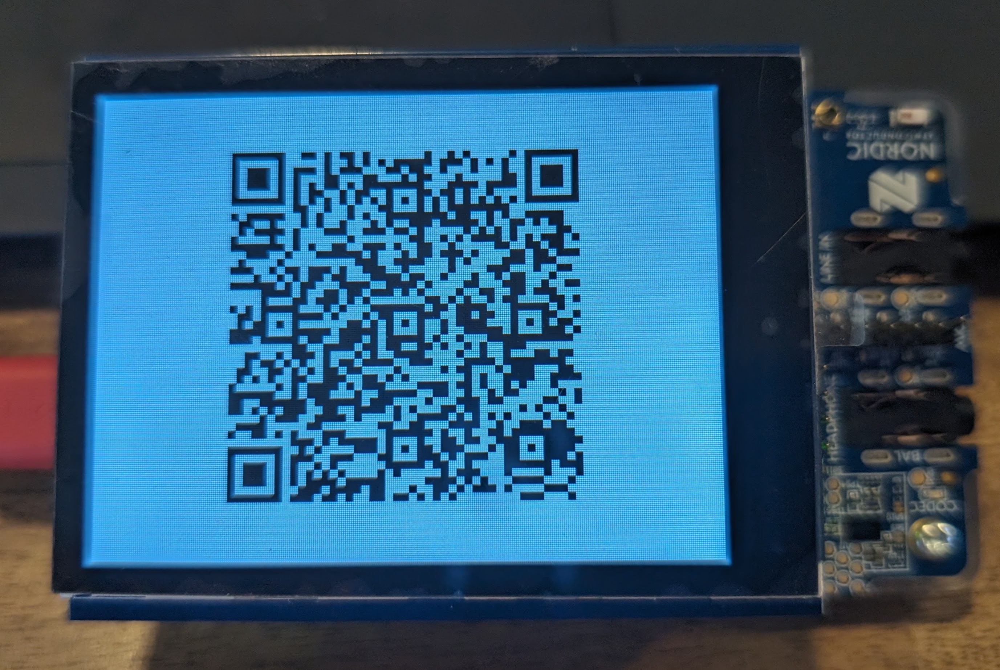

# Broadcast Audio URI Source
The [Broadcast Audio URI](https://www.bluetooth.com/specifications/specs/broadcast-audio-uniform-resource-identifier/) is an exciting new spec that allows information about a Broadcast Audio Source to be conveyed over an out-of-band (OOB) medium to a Broadcast Audio Assistant.

This is a small PoC of how a [Broadcast Audio URI](https://www.bluetooth.com/specifications/specs/broadcast-audio-uniform-resource-identifier/) can be used to expose a dynamically generated QR code on an nRF5340 Audio DK with an Adafruit 2.8" TFT shield attached.

The application is a slightly modified version of the [Broadcast Audio Source sample](https://github.com/zephyrproject-rtos/zephyr/tree/main/samples/bluetooth/broadcast_audio_source).

After the application starts up, a Broadcast Audio URI QR code is shown on the screen like this:



Now, using a Broadcast Audio Assistant able to scan and use the code, it should be possible to add the source to a sink without the assistant scanning for the source first.

NOTE:  This is just an early PoC with only a few values used.  There is currently no support for things like meta data or more advanced BASE topologies.


# Getting started...
If you haven't done it yet, first go to [The Zephyr getting started guide](https://docs.zephyrproject.org/latest/develop/getting_started/index.html) and install all dependencies (I'd recommend following the path with the virtual python environment).

# For development
For developers of the application, first do a fork of the repo.  Then do the following:

Make a local workspace folder (to hold the repo, zephyr and west modules):

```
mkdir my-workspace
cd my-workspace
```

Clone the repo:

```
git clone git@github.com:<your handle>/bau-source.git
```

Initialize west and update dependencies:

```
west init -l bau-source
west update
```

# For normal use (non-development)
This repo contains a stand alone Zephyr application that can be fetched and initialized like this:

```
west init -m https://github.com/larsgk/bau-source --mr main my-workspace
```

Then use west to fetch dependencies:

```
cd my-workspace
west update
```

# Build and flash

Go to the repo folder:

```
cd bau-source
```

## Build

### nRF5340 Audio DK board
The nRF5340 Audio DK has two cores - one for the application and one dedicated for the network (bluetooth controller).
The bluetooth controller can be builded from zephyr/samples/bluetooth/hci_ipc:
```
west build -b nrf5340_audio_dk_nrf5340_cpunet -d build/hci_ipc ../zephyr/samples/bluetooth/hci_ipc --pristine -- -DCONF_FILE=nrf5340_cpunet_iso-bt_ll_sw_split.conf
```
### Application
```
west build -b nrf5340_audio_dk_nrf5340_cpuapp -d build/nrf5340audiodk/app app --pristine -- -DSHIELD=adafruit_2_8_tft_touch_v2
```

## Flash

### nRF5340 Audio DK board
Clear all mem for the two cores with the recover command:
```
nrfjprog --recover --coprocessor CP_NETWORK
nrfjprog --recover
```
And flash with the west command:
```
west flash -d build/hci_ipc
```
### Application
```
west flash -d build/app
```
